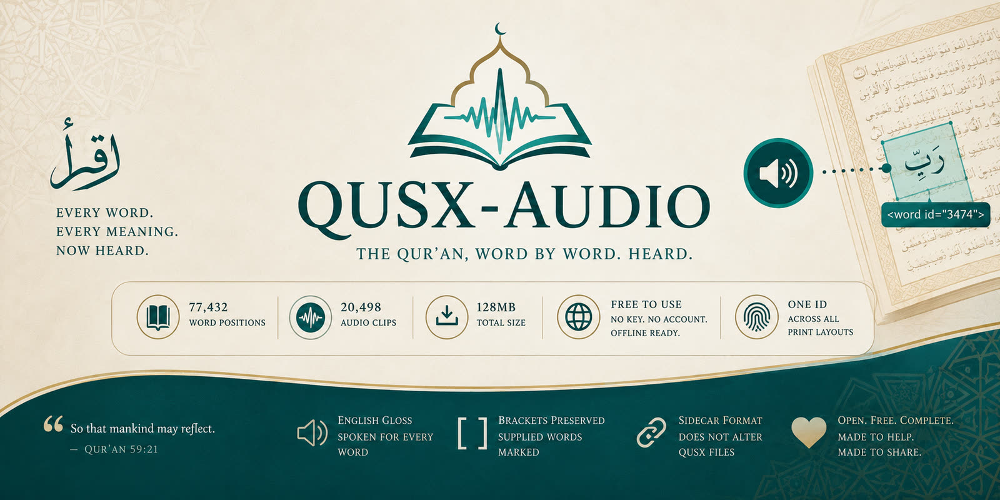

<p align="center">
  
</p>

<p align="center">
  <a href="https://dfordev1.github.io/qusx-audio/"><b>▶ Try it</b></a> ·
  <a href="https://quran-wbw-audio.quran-wbw.workers.dev/en/v1/">Audio endpoint</a> ·
  <a href="spec/qusx-audio.md">Format</a> ·
  <a href="tools/">Pipeline</a>
</p>

---

There is a particular difficulty in learning the Qur'an without Arabic. The eye moves
across a line of text and the mind reaches for meaning it does not yet hold.
Word-by-word translations exist to close that gap, and they help — but they remain
silent. A reader who cannot yet read, or cannot see the page at all, is left outside.

This is an attempt at one small part of that problem: **an English gloss, spoken aloud,
for every word of the Qur'an.**

## Try it

```js
const BASE = 'https://quran-wbw-audio.quran-wbw.workers.dev/en/v1';
const idx  = await (await fetch(`${BASE}/index/001.json`, {cache:'no-cache'})).json();

const clip = idx.words['1'];       // QUSX word id 1  =  بِسْمِ
idx.text[clip];                    // "In (the) name"   as printed
idx.spoken?.[clip];                // "In the name"     what the audio says
idx.roman?.[clip];                 // romanisation, where the language ships one
new Audio(`${BASE}/audio/${clip}.opus`).play();

// The same word id in another language. Nothing else changes.
const hi = await (await fetch(
  'https://quran-wbw-audio.quran-wbw.workers.dev/hi/v1/index/001.json')).json();
hi.text[hi.words['1']];            // "साथ नाम"
hi.roman[hi.words['1']];           // "saath naam"
```

The [demo page](https://dfordev1.github.io/qusx-audio/) is one HTML file with no build
step. It reads Arabic from the QUSX repo and audio from the endpoint above — exactly
what any other project would do.

## What has been made

Two languages, sharing one set of word ids.

| | English | Hindi |
|---|---|---|
| Audio clips | **20,498** | **24,182** |
| Word positions | **77,432** — all | **77,432** — all |
| Qur'an covered | **100%** | **100%** |
| Size | 128 MB | 155 MB |
| Romanisation | — | included |
| Endpoint | `/en/v1/` | `/hi/v1/` |

Both are free, need no key and no account, and are addressed by QUSX word id —
identical across all ten print layouts.

The Hindi source describes the Qur'an in 70,522 pieces rather than 77,432, because it
sometimes covers two Arabic words in one gloss. Those 6,910 positions share the clip of
the neighbour whose gloss covers them, and are declared in a `merged` map so a consumer
can present them as one reading. No audio was generated for them: the meaning was
already in that clip.

Hindi also ships a romanisation, generated mechanically — Devanagari writes its short
vowels, so transliteration needs no dictionary and no guesswork.

Each clip is addressed by its QUSX word id, a single number running the length of the
text. A reader holding `<word id="3474">` needs nothing else to find the sound that
belongs to it. The ids are the same across Madani, IndoPak, Nastaleeq and the rest, so
an application may render whichever script its readers prefer without the audio caring.

Because words repeat, they are stored once. `Allah` appears in 3,141 places and is a
single file. The consequence is practical: a reader's device learns the common
vocabulary of the Qur'an within a few pages, and everything afterwards arrives
instantly.

Alongside the audio, each index carries the gloss itself — as printed, with the
brackets that mark words the translator supplied rather than words present in the
Arabic. `In (the) name`. That distinction is the whole discipline of a word-by-word
gloss, and it survives into the published data.

## What it is not

The voice is a clone built from hours of real recording, and a professional one. Every
clip here is still **synthesised**. No human read these words.

It speaks an **English translation, not the Qur'an**. Nothing here is recitation, and
nothing here should be mistaken for it.

I state this plainly and early, because for some purposes it settles the matter, and no
one should have to discover it three screens in.

## Where it is weak

Completeness is not correctness, and it would be dishonest to present the one as the
other.

Around fourteen hundred clips were checked by transcribing them back and comparing
against the intended words. The remaining nineteen thousand were not. They were produced
by a process that tested reliably on multi-word phrases, which is a reason for
confidence but not a substitute for having listened.

Transliterated names resist checking altogether. `Lut`, `Yaqub`, `Zaqqum`, `Firaun`, and
the letter-openings `Alif Laam Meem` — a speech recogniser cannot spell them any better
than a speech synthesiser can pronounce them, so the verification I have simply falls
silent there. That is **713 glosses across 4,362 positions**, unverified by nature
rather than by neglect.

If you hear something wrong, please [open an issue](../../issues). One report is worth
more than a great deal of my own re-checking.

## Two things that went wrong, in case they save you the trouble

**Segmentation drifts quietly.** My source treated `بَعْدَ مَا` as one word where QUSX
treats it as two — in three verses out of six thousand. The totals still agreed. Only a
comparison ayah by ayah revealed it, and until it did, every word after that point in
those verses carried the audio of its neighbour. If you align a translation to a text,
compare per verse. A matching total can conceal errors that cancel.

**Brackets carry two different meanings.** In `In (the) name`, they mark a supplied
word. In `disbelieve [d]`, they mark an inflection belonging to the word before them. I
treated both alike and removed them, which turned one into "disbelieve dee" — spoken
that way in 210 places before it was caught, by a reader noticing a single verse.

Both are written into the [specification](spec/qusx-audio.md) now, so that the next
person meets them as documentation rather than as a bug.

## What I would ask of you

**On provenance.** The English text is QUL's *Colored English wbw translation*
(resource 564). QUL names no author for it, but its own metadata links the resource to
an archive.org scan of a book whose stated creator is **Darussalam** — a commercial
publisher. So the honest position is not "unclear": it should be treated as copyrighted
until Darussalam says otherwise.

The Hindi (resource 44) has no author, source or metadata recorded at all. It closely
tracks Dr. Farhat Hashmi's Urdu word-by-word, which points at Al-Huda International,
unconfirmed.

I would rather attribute both properly, or withdraw them, than leave this open. If you
know the terms, please say. See [DATA-LICENCE.md](DATA-LICENCE.md).

**On the format.** QUSX-Audio is deliberately a sidecar. It adds nothing to a
`.qusx.xml` file and asks nothing of consumers who do not want sound. Any language, any
voice, any recitation may attach to the same word ids without competing. If the shape of
it is wrong, now is the time — before anyone builds on it.

**On other languages.** Adding Hindi changed a URL prefix and nothing else — same word
ids, same clip-id scheme, no coordination with the English set. Turkish, Indonesian,
Bengali and Persian word-by-word texts all exist at QUL and would go through the same
pipeline. I would be glad to help anyone attempting one.

One warning from doing Hindi: Urdu script omits short vowels, and the synthesiser
guessed them wrong on the commonest words -- سے came back as *si*, کہ as *ki*.
Devanagari writes those vowels, which is why Hindi worked where Urdu did not. If your
source script leaves vowels unwritten, expect to supply them.

## What is here

| | |
|---|---|
| [`spec/`](spec/) | the QUSX-Audio 0.1 format and its JSON schema |
| [`index/en/v1/`](index/en/v1/) | 114 English indexes — word id, clip, gloss |
| [`index/hi/v1/`](index/hi/v1/) | 114 Hindi indexes — with romanisation |
| [`tools/`](tools/) | the pipeline that produced them |
| [`examples/`](examples/) | reference player and Cloudflare Worker |
| [`docs/`](docs/) | the demo page |

Audio files are not in this repository — 44,680 clips across both languages, 283 MB.
They are served from the endpoints above. The indexes are, because they are small and
useful on their own.

## Rebuilding

```bash
python tools/qul_english_to_csv.py colored-english-wbw.zip -o data-en/source/wbw.csv
python tools/make_wordlist.py data-en/source/wbw.csv \
       --wordlist data-en/wordlist.csv --index data-en/index.csv \
       --casefold --strip-brackets
python tools/compare_qusx.py --data data-en          # must report 0 differences
python tools/review_english.py --raw <zip> --data data-en
python tools/tts_generate.py --data data-en --voice <id>
python tools/export_words.py --data data-en --out dist-words --base-url <url>
python tools/upload_s3.py --dist dist-words --prefix en --version v1
```

`compare_qusx.py` is not optional — see the first of the two mistakes above.

## Licence

Code and the specification: MIT, see [LICENSE](LICENSE).
The gloss text is not ours: see [DATA-LICENCE.md](DATA-LICENCE.md) before redistributing
it or the audio derived from it.

---

The Qur'an has been carried across fourteen centuries by people who took great care with
small details. This is a modest thing by comparison, and imperfect in ways I have tried
to describe accurately rather than minimise. But it is complete, it is free, and it is
open — and if it lets one person hear a meaning they could not read, it was worth
building.

Corrections and criticism both welcome.

> *So that mankind may reflect.* — Qur'an 59:21
